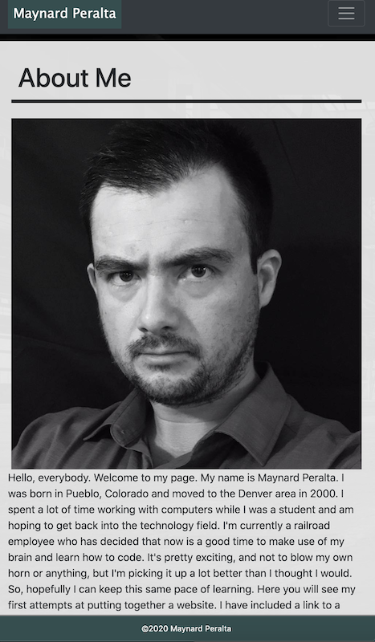
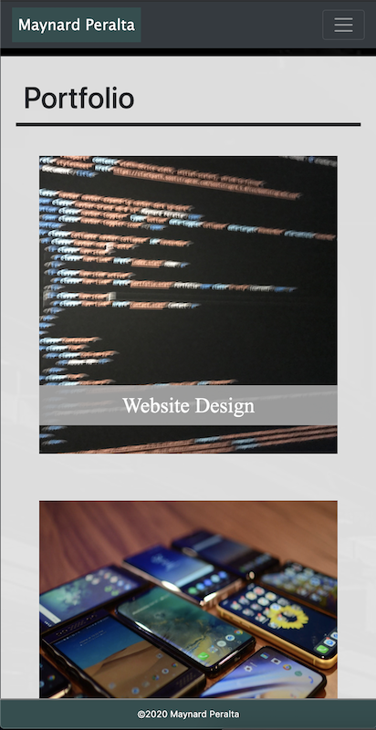
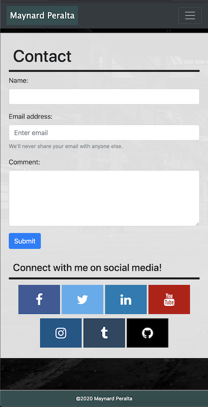
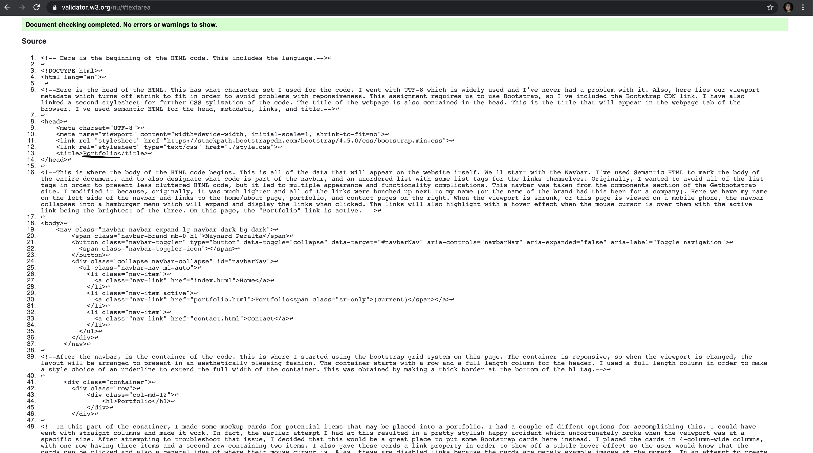

# Homework2

## Introduction

This homework assignment required us to create a reponsive portfolio website consisting of three pages - Home/About Me, Portfolio, and Contact. We were to use semantic HTML and Bootstrap CSS.
Personally, I found this assignment to be quite challenging because of my limited, as well as novice, knowledge of coding overall. Nevertheless, I used every resource at my disposal and dedicated A LOT of personal time in order to complete this project to the best of my ability. Using the components available on the GetBootstrap.com website, I was able to add many features by simply copying the code from this website, and further style it with an additional CSS style sheet. 

### Process

The process of the website started with blank HTML pages. We were given pictures to use as inspiration in order to help us get an idea of what to shoot for. We were to create the pages using Bootstrap and the grid system. So, in order to use the Bootstrap components, I included a link to the Bootstrap CSS cdn style sheet in the head of each page. I also had an additional CSS stylesheet in order to further style the html pages. The navbar on each page would also collapse when the screen size was reduced past a certain point, so it was important to include the Bootstrap scripts in order to get the navbar to function properly. The assignment also made the request to minimize the use of media queries. I'm pretty happy that I was able to get the reponsiveness I desired without having to add any additional media queries. 

#### About Me/Index

 This page would be my "About Me" page with my headshot and a short biography. I felt it would be easier to just start with the index page because it would be the first page a user would see. The pictures we were to use as a guide showed a lot of empty real estate on the right side of the viewing area when viewed on a large screen. Personally, I'm not a big fan of wasted space, so I opted to use as much of the screen as possible while still having margins on the left and right sides of the screen when viewed on larger screens. I also had to be sure the page was responsive and would have no margins when viewed on a smaller screen, so I had to account for that as well. The finished product is as shown below in a large screen layout: 

 
And here is that same page viewed on a much smaller screen:
 

I had to ensure that all of my HTML code was correct and all of the links worked. I also had to make sure that all of the elements were responsive and nothing broke out of the container element when the screen size was changed. You're probably saying to yourself "Wow, there's no color on that page whatsoever." And you would be correct. I am colorblind, so I'm always running the risk of using colors that clash although they would look fine to me. Now, if I were to be designing a page for a client, I'd be using all of the colors and branding they'd provide. And if they didn't specify, I'd be sure to ask and get feedback throughout the entire project. I could have easily said this was some sort of artsy design, but it's best to be honest. 

#### Portfolio

For the next HTML document, I tackled the "Portfolio" page. I copied the HTML code from the index.html page in order to ensure everthing outside of the container remains uniform (which would include the navbar and footer). This page has bootstrap cards that include pictures and styled text. Ideally, these cards act as links to different areas of the website in order to showcase more of a well-rounded portfolio. As for now, these cards are disabled links. They are only assigned links in order to show off a hover effect when the mouse cursor is over the image. This page is also responsive with a large screen and smaller screen shown below. 

 

#### Contact

The third html document is the "Contact" page. As with the portfolio page, I merely copied the code from the index document in order to keep the footer and navbar exactly the same. This page has a form which would normally be used to send a message and/or feedback. Alas, this form is not functional at the moment (I haven't learned how to create functional forms just yet. I'm hoping to learn that process soon enough). Below this form, there are icons that act as links to my personal social media pages. These icons are possible through Font Awesome. In order to obtain these icons, I had to include a link to the Font Awesome CSS cdn. As with the other two pages, this page is responsive with examples of two different screen sizes below.

 

#### HTML Validation

Lastly, I had to ensure each page had valid and correct HTML. I used the website Validator.W3.org in order to ensure I met this requirement. The results for each page are at the top of the screenshots below.

That is all as far as the process. More detailed notes can be found in the comments of the HTML and CSS documents of the assignment. 

