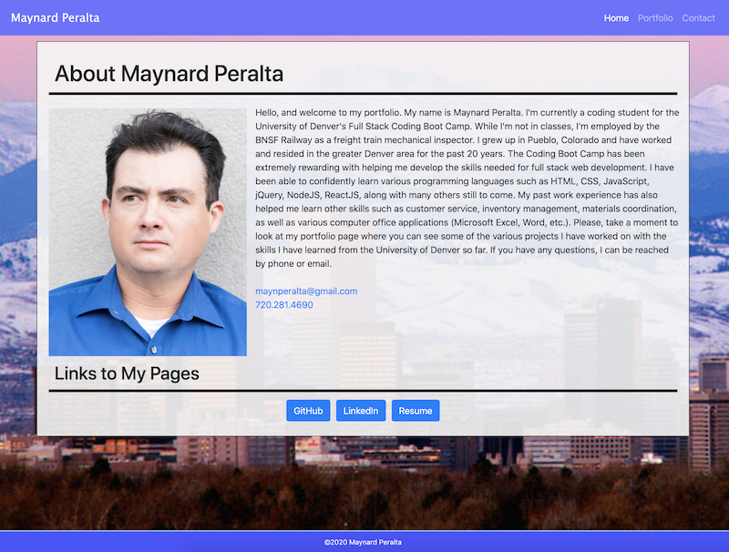
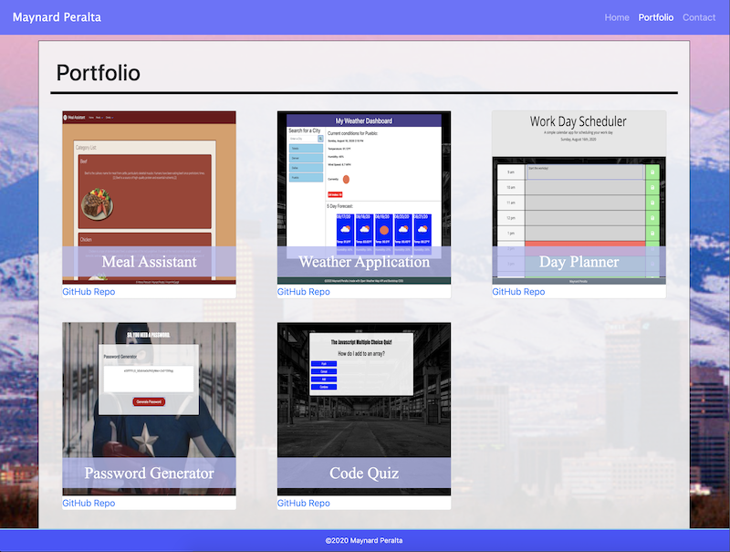

# Maynard Peralta's Portfolio

## Introduction

This is my personal portfolio showcasing the projects I have completed using the education I gained from the University of Denver's full stack coding boot camp program. The projects include a collaboration group project as well as projects I completed myself. 

## Technologies Used
    * HTML
    * CSS
    * Bootstrap CSS
  
## Screenshots

 

## Deployed Link

The deployed portfolio can be found [here](https://maynperalta.github.io/Maynard-Peralta-Portfolio/).

## Contact Information
I can be contacted via email at:
<maynperalta@gmail.com>
 
